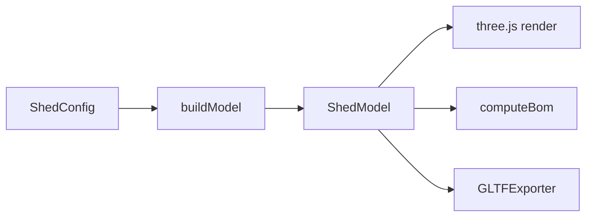

# Design Log #0001 — Architecture & Stack

## Background

A configurator for a garden shed: post-and-beam, rectangular base, mono-pitch roof
(ref: diysheds.co.uk). It must show a live 3D model, measure it, export a CAD-readable
model, and output a full bill of materials (BOM).

## Problem

The 3D view, the BOM, and the export must never disagree. If each is computed
independently they drift. We need one source of truth for geometry.

## Questions and Answers

- **Roof type?** Mono-pitch (low/high eave). Flat is just near-zero slope.
- **UI stack?** Vite + React + TypeScript; three.js driven imperatively in a canvas,
  React for the config/BOM panels.
- **Units?** Millimetres throughout (UK reference). UI shows mm.
- **CAD export?** glTF (`.glb`) — practical and "CAD-readable enough". IFC/STEP out of scope.

## Design

A **pure model layer** (no three.js) maps `config → ShedModel → BOM`. Rendering, BOM, ruler,
and export all consume the same derived `ShedModel`.



Layout:

```
src/config/   schema, profile library, fastener catalog, defaults, presets
src/model/    foundation, floor, walls, openings, roof, build, geometry, sheets  (no three.js)
src/bom/      compute (timber/sheets/membrane/fasteners)
src/viewer/   Scene, render, textures, Ruler, Exporter
src/ui/       App, ConfigPanel, LayersPanel, BomTable, Toolbar, Viewport, useShed, fields
```

State flow: `useShed` holds `ShedConfig`, memoizes `buildModel(config)` then `computeBom(model)`.
The canvas rebuilds three.js objects when the model reference changes.

## Implementation Plan

1. Scaffold (Vite react-ts, three, strict tsconfig). 2. config layer. 3. model layer.
2. viewer. 5. UI. 6. BOM. 7. openings. 8. ruler/export. 9. presets/layers.

## Trade-offs

- ✅ Pure model layer → testable without a browser, single source of truth.
- ✅ Procedural canvas textures → zero external assets, offline-friendly.
- ❌ Imperative three.js (not react-three-fiber) → more manual scene wiring, but full control
  for ruler/snapping/edges.
- glTF over IFC: loses semantic BIM data, keeps it simple.

## Verification

`npm run dev` renders the shed; editing any control updates model + BOM live.
`npm test` checks model invariants. `npm run build` + `tsc` clean.

## Implementation Results

Implemented as designed. Vitest model suite: 27/27 passing. Build clean. See logs #0002–#0007
for subsystem detail.
