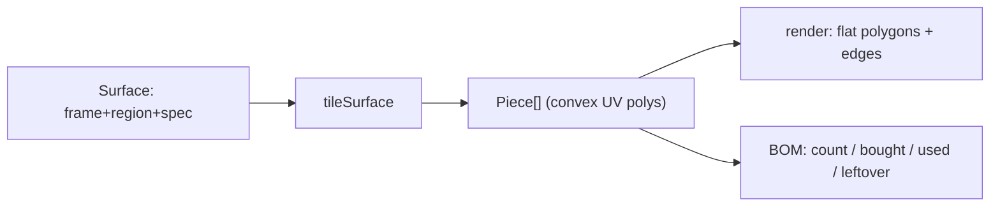

# Design Log #0008 — Discrete (Real-Size) Materials & Cut Lists

## Background
Today OSB, cladding, and roofing are each rendered as a **single textured panel** per region
(`Panel` with `kind`, `area`). The BOM turns area into a sheet count via `ceil(area / sheetArea)`.
This is an approximation — real builds use fixed material sizes (OSB 1200×2400, cladding boards,
shingles) that get cut to fit, producing offcuts.

## Problem
Model each sheet/board/shingle as an **individual piece of configurable size**, tiled and **cut to
fit** the surface (including angled cuts at the gable rake and around openings). The BOM must then
report, per material: **pieces to buy**, **area bought** (`piece size × count`), and **leftover
area** (waste from cutting = bought − used).

## Questions and Answers
> Answer inline; keep the questions.

- **Q1. Which materials become discrete?** Proposed: wall/floor/roof **OSB**, **soffit** (sheet
  good), **cladding** boards, **shingles**, **metal shingles**. Membrane stays continuous (a roll →
  keep area-based). — *Confirm soffit is included.*
  **A: No — soffit stays a single continuous area (a real layout/nesting solver is out of scope for
  now). Show soffit OSB as its own area-only BOM line, separate from the tiled OSB. Discretize:
  wall/floor/roof OSB, cladding, shingles, metal shingles.**
- **Q2. Piece sizes (new configurable params):** OSB sheet 1200×2400; cladding board *width* (e.g.
  150) × *length* (e.g. 3600); shingle *width*×*height*; metal shingle *width*×*height*.
  **A: Defaults OK.**
- **Q3. Shingle overlap/exposure?** Real shingles overlap (visible "exposure" < height).
  **A: Model real overlap/exposure, and make the exposure configurable (asphalt and metal each).**
- **Q4. Joins when a surface is larger than one piece?** Tile in **both axes**, cutting at joins.
  **A: Yes.**
- **Q5. Cut-list / leftover model:** each placed piece = **one stock unit bought** (no nesting).
  `bought = count × nominalArea`, `used = Σ clipped area`, `leftover = bought − used`.
  **A: Confirmed — no nesting.**
- **Q6. Render fidelity:** flat polygon vs extruded prism per piece.
  **A: Extruded with real thickness.**
- **Q7. Performance:** per-piece meshes; shingles with exposure → more pieces.
  **A: Accepted; use sane default piece sizes to keep counts reasonable.**

## Design

### New concept: a tiled surface
A **surface** = a planar frame + a region + a tiling spec.
```ts
interface Frame   { origin: Vec3; uDir: Vec3; vDir: Vec3; normal: Vec3; offset: number } // u,v are unit dirs
interface Region  { kind: 'rect'; w: number; h: number; holes: UvRect[] } | { kind: 'triangle'; a; b; c: Vec2 }
interface TileSpec{ materialId: string; pieceW: number; pieceH: number; courseStep: number; columnStep: number; stagger: boolean }
// courseStep < pieceH ⇒ overlap (shingle exposure); default courseStep=pieceH, columnStep=pieceW.
interface Piece   { materialId: string; poly: Vec2[]; nominalArea: number; usedArea: number } // poly in UV, convex
```
`tileSurface(frame, region, spec): Piece[]` — model-only, no three.js (`src/model/tiling.ts`).

### Tiling algorithm
Global grid anchored at the region origin so courses/columns stay aligned across openings.
For each grid cell (a `pieceW × pieceH` UV rectangle, optionally staggered per row):
- **rect region:** intersect cell with `[0,w]×[0,h]`, then **subtract opening holes**
  (axis-aligned rect − rect → up to 4 rects). Each surviving rect is a `Piece`.
- **triangle region (gable):** clip cell to the triangle with **Sutherland–Hodgman** (triangle is
  convex) → one convex polygon per cell.
- `usedArea` = clipped polygon area; `nominalArea` = `pieceW × pieceH`; full cells have `used = nominal`.



### Model wiring
- Wall layers, roof layers, floor deck, soffit currently emit one `Panel` (or a few) per region.
  Instead emit a **`Surface`** for the discrete kinds; `buildModel` runs `tileSurface` → `pieces`.
- `ShedModel` gains `pieces: Piece3D[]` (UV mapped to 3D via the frame). Membrane stays a `Panel`.
- Reuse existing region math: `decomposeWall` already yields opening-cut rects; lapping/offsets
  from #0003/#0004 carry over to the surface frame.

### Render
`pieceMesh(piece)`: build a `THREE.Shape` from the UV polygon, `ExtrudeGeometry(depth = thickness)`,
orient with `makeBasis(uDir, vDir, normal)` and position at `origin + normal·(offset − thickness/2)`
→ a real prism. Textured per material + `withEdges`. Layers unchanged (groups hold many meshes).
Soffit stays a single `Panel` (area-only).

### BOM
`computeBom` groups `pieces` by `materialId`:
```
count = pieces.length
boughtArea = count × nominalArea       used = Σ usedArea       leftover = boughtArea − used
```
Line: `"OSB 1200×2400 — 11 sheets · 31.7 m² bought · 4.2 m² offcut"`. Membrane keeps area-only.

## Implementation Plan
1. **Config**: piece-size params (`stock.sheet*` exists; add cladding board w/l, shingle w/h, metal
   shingle w/h). Type updates + UI inputs.
2. **`model/tiling.ts`**: rect tiler + opening subtraction + triangle clipper; `Piece` type; area helpers.
3. **Wire** walls/roof/floor/soffit to emit surfaces → pieces; membrane unchanged.
4. **Render** pieces (polygon meshes + edges + per-material textures).
5. **BOM**: piece aggregation (count/bought/used/leftover) + table rows.
6. **Tests**: Σ used ≈ region area (±ε); piece counts vs expected grid; leftover ≥ 0; gable pieces
   clipped to the rake; opening holes excluded.

## Trade-offs
- ✅ Real cut lists and waste — much closer to reality.
- ❌ Heavier scene (many meshes) and more model compute.
- ❌ Flat pieces lose box thickness (Q6).
- ❌ Naive cut-list over-estimates waste vs. nesting (Q5) — but matches the requested formula.

## Verification
- For a plain rectangular wall, `count == ceil(w/pieceW) × ceil(h/pieceH)` and `Σ used == w·h`.
- Gable: pieces above the rake line are clipped (Σ used == triangle area).
- Openings: no piece area inside an opening.
- BOM: `leftover == bought − used ≥ 0`; full-coverage surfaces have `leftover == Σ(nominal−used)`.

## Implementation Results
Implemented. New: `src/model/tiling.ts` (`tilePolygon` + Sutherland–Hodgman clip + rect-minus-rect
opening subtraction) and `src/model/materials.ts` (`materialSpecs` single source). `Piece` added to
`ShedModel`; walls/floor/roof emit OSB + cladding + roofing as pieces (membrane + soffit stay
panels). Render extrudes each piece (`ExtrudeGeometry` + basis matrix) with black edges; OSB keeps
its strand texture (UV in mm, repeat 1/600), cladding/roofing are solid colours delineated by edges.
BOM emits per-material **count / bought / offcut**; soffit + membrane stay area-only.

**Deviations from design:**
- **Q3 (overlap):** implemented via `courseStep = exposure` (course spacing < piece height ⇒
  overlap), with configurable exposure for shingles and metal — as agreed.
- **Q6 (extruded):** pieces are real prisms.
- **Q1 (soffit):** stays a single area-only panel (own BOM line "Soffit OSB").
- **Cladding/roofing textures dropped** for pieces — individual geometry + edges convey the pattern;
  the per-piece shingle/cladding textures would have shown a whole pattern inside one piece. OSB
  texture kept (a sheet legitimately shows strands). Unused texture generators left in `textures.ts`.
- Rather than separate rect + gable-triangle tiling, each wall is one **convex outline**
  (rectangle for front/back, trapezoid for gables) tiled once — so a cladding board is a single
  piece cut to the rake, not split at the eave line.

**Tests:** `tests/model.test.ts` 30/30 passing (migrated the 8 panel-based assertions to pieces;
added a `discrete materials (cut list)` block: tiling coverage, `leftover ≥ 0`,
full-vs-cut pieces, shingle overlap). `tsc` + `vite build` clean.

**Sanity (default 6×4):** OSB floor 10 pcs (used 24.0 m² = footprint), OSB wall 45 pcs (offcut
78 m² — expected under the no-nesting model), cladding 140 boards, roofing 217 shingles /
84 metal tiles (overlap modelled).

**Known follow-ups:** no offcut nesting (per Q5, conservative); OSB-wall waste is high because each
clipped sheet counts as one bought sheet — a future nesting/layout solver would cut this.
