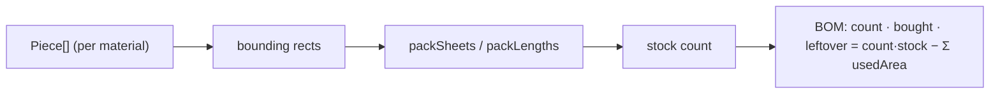

# Design Log #0009 — Nesting / Cut Optimizer

## Background
#0008 made OSB/cladding/roofing discrete pieces and a cut list where **each placed piece = one
bought stock unit** (no offcut reuse). That inflates waste — e.g. 45 OSB-wall sheets / 78 m² offcut
on the default shed, because every clipped partial sheet is charged a whole sheet.

## Problem
Compute a realistic **number of stock units to buy** by nesting the required cut parts into stock
sheets/boards (reusing offcuts), and report the true leftover.

## Library survey
- **maxrects-packer** — multi-bin, fixed bin size, rotation; but texture-atlas oriented (no
  guillotine/kerf/grain), and only covers the 2D (OSB) case.
- **rectangle-packer / rectpack-ts** — area + guillotine heuristics.
- **SVGnest / Deepnest** — true irregular nesting; far too heavy for rectangles.
- Our problem is three sub-problems; only OSB is real 2D nesting. Cladding is 1D (fixed width),
  shingles are discrete units.

**Decision (approved):** write a compact guillotine packer in the model layer (pure, deterministic,
testable, no dependency). Rotation **allowed** for OSB.

## Questions and Answers
- **Q1. Library vs own?** **A: Write our own guillotine packer.**
- **Q2. Allow 90° rotation when packing OSB?** **A: Yes (estimate; ignores strand direction).**
- **Q3. Which materials nest?** **A: OSB → 2D guillotine; cladding → 1D (first-fit-decreasing on
  length, fixed board width); shingles/metal tiles stay discrete units (count unchanged).**
- **Q4. Kerf (saw width)?** **A: ignore for v1; note as follow-up.**

## Design (`src/model/nesting.ts`, pure, no three.js)
```ts
interface Part { w: number; h: number }
// 2D guillotine free-rectangle packing into binW×binH bins; returns number of bins used.
function packSheets(parts: Part[], binW: number, binH: number, allowRotate: boolean): number
// 1D first-fit-decreasing: pack lengths into stockLen boards; returns number of boards.
function packLengths(lengths: number[], stockLen: number): number
```
- **packSheets**: sort parts by area desc; for each, scan existing bins for the best-fit free rect
  (try both orientations if `allowRotate`), place top-left, **guillotine-split** the free rect by the
  shorter leftover axis into two non-overlapping free rects; open a new bin if none fits.
- **packLengths**: sort desc; place each into the first board with enough remaining length, else a
  new board.

The 3D model is unchanged — nesting only feeds the **BOM**. Each model `Piece` contributes its
**bounding rect** (uv bbox: clipped pieces are conservatively boxed) as a part.



### BOM integration (`bom/compute.ts`)
- **OSB** (`osb-floor/wall/roof`): `sheets = packSheets(bboxes, sheetW, sheetH, true)`;
  `bought = sheets·sheetArea`; `used = Σ piece.usedArea`; `leftover = bought − used`.
- **Cladding**: `boards = packLengths(pieceHeights, board.length)` (width fixed);
  `bought = boards·(width·length)`; `used = Σ usedArea`.
- **Roofing**: unchanged (each shingle/tile is a bought unit).

## Implementation Plan
1. `model/nesting.ts` — `packSheets`, `packLengths` (+ tiny rect helpers).
2. `bom/compute.ts` — replace OSB/cladding piece-count lines with nested counts; keep roofing.
3. Tests — packing never below the area lower bound `ceil(Σarea/binArea)`; nesting ≤ naive
   piece count; full sheets stay 1-per-bin; 1D correctness; determinism.

## Trade-offs
- ✅ Realistic counts/waste; offcut reuse modelled.
- ✅ Pure + deterministic → unit-testable, no dependency.
- ❌ Heuristic (FFD guillotine), not optimal; no kerf (Q4); rotation ignores strand strength (Q2).

## Verification
- `packSheets` result ∈ [`ceil(Σarea/binArea)`, naive count]; default shed OSB-wall sheets drop
  well below 45.
- `leftover ≥ 0`; deterministic across runs.

## Implementation Results
Implemented `src/model/nesting.ts` (`packSheets` — 2D guillotine, best-fit free-rect, shorter-axis
split, optional rotation; `packLengths` — 1D FFD). `bom/compute.ts` now nests: OSB → `packSheets`
(rotation on), cladding → `packLengths` on board lengths, shingles unchanged (units). The 3D model
is untouched — nesting affects the BOM only, fed by each piece's UV bounding rect.

**Effect (default 6×4 shed):**
| material | before (#0008) | after nesting |
|---|---|---|
| OSB wall | 45 sheets · 78 m² offcut | **20 sheets · 6.1 m² offcut** (area lower bound = 18) |
| OSB roof | 12 · 6.8 | 11 · 4.0 |
| OSB floor | 10 · 4.8 | 10 · 4.8 (all full sheets) |
| Cladding | 140 boards · 20.5 | 126 boards · 15.6 |

**Tests:** `tests/nesting.test.ts` (8) — one-sheet-per-full-part, quarter-sheet packing, area lower
bound, rotation helps, determinism, 1D cases. Total suite 38/38. `tsc` + `vite build` clean.

**Deviations:** none from the approved design. Clipped (gable/edge) pieces are nested by their
bounding rect (conservative). No deviation on Q1–Q4.

**Known follow-ups:** no kerf (Q4); rotation ignores OSB strand strength (Q2); FFD-guillotine is a
heuristic, not optimal (wall result 20 vs lower bound 18).
