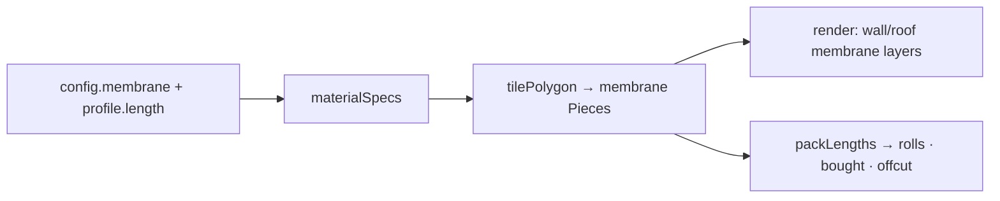

# Design Log #0010 — Per-Profile Stock Lengths & Tiled Membrane

## Background

The BOM currently charges every timber profile against one global `stock.timberLength` (4.8 m), and
membrane is still a single continuous `Panel` (area-only, no overlap, not cut at openings).
Real stock comes in per-product lengths, and membrane is laid in overlapping horizontal rolls.

## Problem

1. Give **each timber profile its own stock length**, configurable, and use it in the cut list.
2. Make **membrane a configurable roll** (width, length, overlap) and tile it like the other skins:
   horizontal rolls, courses overlapping top-over-bottom, cut around openings, nested into rolls for
   the BOM.

## Questions and Answers

- **Q1. Where does per-profile length live / what about the global `stock.timberLength`?**
  **A: Add `length` to `TimberProfile` (edited in the Profile dialog); remove `stock.timberLength`.
  Old localStorage profiles lacking `length` fall back to 4800 in the BOM.**
- **Q2. One membrane spec or separate wall/roof?** **A: Separate — `config.walls.membrane` and
  `config.roof.membrane`, each `{ rollWidth, rollLength, overlap }` (wall = breather, roof =
  EPDM/breather, different rolls). Wall inputs in the Walls section, roof inputs in the Roof section.**
- **Q3. Roll orientation?** **A: Rolls run horizontally** — `rollWidth` is the course _height_,
  `rollLength` the horizontal run; courses step up by `rollWidth − overlap` so each overlaps the one
  below (water sheds down). Same as shingles, just unstaggered.
- **Q4. Timber cut list — keep `ceil(total/length)` or nest?** **A: Nest with the existing
  `packLengths` (1D FFD) per profile → realistic board count + offcut, consistent with cladding.**
- **Q5. Membrane BOM unit?** **A: Rolls.** 1D-nest each strip's run-length into `rollLength`;
  `bought = rolls · rollWidth · rollLength`, `used = Σ piece area` (incl. overlap), `offcut = bought − used`.
- **Q6. Defaults?** **A: profile length 4800; membrane rollWidth 1500, rollLength 50000, overlap 150.**

## Design

**Per-profile length** (`config/types.ts`): `TimberProfile { id, label, thickness, width, length }`.
`bom/compute.ts` `timberLines` groups members by profile, then `packLengths(memberLengths,
profile.length)` → boards; reports pieces, total m, boards, offcut m. `stock.timberLength` removed.

**Membrane becomes pieces.** Add `membrane-wall` / `membrane-roof` to `MaterialId`; `materialSpecs`
gives them a tiling spec from `config.walls.membrane` and `config.roof.membrane` respectively:

```
pieceW = rollLength, pieceH = rollWidth, courseStep = rollWidth − overlap, columnStep = rollLength,
stagger = false, thickness = MEMBRANE_THICKNESS
```

- `walls.ts` / `roof.ts`: membrane is produced via `tilePolygon` (same outline + opening holes as
  OSB/cladding) instead of `makePanel`. Soffit stays the only `Panel`. `membrane-wall`/`membrane-roof`
  are removed from `PanelKind`.
- `render.ts`: membrane pieces route to the `wallMembrane` / `roofMembrane` layers with the membrane
  texture (extruded like every other piece).
- `bom/compute.ts`: membrane lines move to the piece/nesting path (rolls via `packLengths` on each
  piece's run-length); the old area-only membrane lines are dropped (soffit stays area-only).



**UI:** Profile dialog gains a Length column. Walls section gains Membrane roll width / roll length /
overlap (`config.membrane`).

## Implementation Plan

1. `config/types.ts` (+`length`, +`MembraneConfig`, −`stock.timberLength`), `profiles.ts`,
   `defaults.ts`.
2. `materials.ts` — membrane spec + `MaterialId` + move `MEMBRANE_THICKNESS` here.
3. `walls.ts` / `roof.ts` — membrane via `tilePolygon`; drop membrane panels; `PanelKind` cleanup.
4. `render.ts` — membrane pieces → layers + texture.
5. `bom/compute.ts` — per-profile nested timber; membrane rolls.
6. `ProfileDialog.tsx` (length column) + `ConfigPanel.tsx` (membrane rows).
7. Tests: profile length drives boards; membrane tiled, overlaps (smaller overlap ⇒ fewer/more
   pieces?), cut at openings; rolls ≥ area lower bound.

## Trade-offs

- ✅ Realistic timber + membrane cut lists; membrane visually layered with overlap.
- ❌ More pieces/geometry (membrane courses overlap → many strips).
- ❌ `stock.timberLength` removal needs the old-config fallback (Q1).
- Membrane treated as 1D (fixed roll width) — fine, rolls have a fixed width.

## Verification

- Editing a profile's length changes its board count/offcut in the BOM.
- Membrane appears as overlapping horizontal courses, cut at openings; `rolls ≥ ceil(usedArea /
rollArea)`; `offcut ≥ 0`.

## Implementation Results

Implemented. `TimberProfile.length` added (default 4800, edited in the Profile dialog, falls back to
`DEFAULT_PROFILE_LENGTH` for old localStorage); `stock.timberLength` removed. Separate
`config.walls.membrane` and `config.roof.membrane` (`{ rollWidth, rollLength, overlap }`), inputs in
the Walls / Roof sections. `materialSpecs` adds `membrane-wall` / `membrane-roof` tiling specs;
walls/roof emit membrane via `tilePolygon` (cut at the wall outline + openings); membrane removed
from `Panel` (soffit is the only remaining panel). Render routes membrane pieces to the wall/roof
membrane layers with the membrane texture. BOM: timber `packLengths` per profile (boards · used ·
offcut); membrane rolls via `packLengths` on each strip's run length.

**Deviation / fix:** `packLengths` mishandled items **longer than the stock unit** (charged one
board), which surfaced as a **negative fascia offcut** (eave fascia ≈ 6.3 m vs 4.8 m stock). Fixed to
split oversize items across `ceil(len/stock)` boards. Added a regression test.

**Tests:** 42/42 (added membrane tiling/overlap/opening-cut, per-profile board count, oversize
`packLengths`). `tsc` + Prettier + build clean.

**Sanity (default 6×4):** Fascia 6×4.8 m boards (+7.5 m offcut, no longer negative); wall membrane
2 rolls (1500×50000); roof membrane 2 rolls (1000×20000); membrane renders as overlapping courses.

**Known follow-ups:** oversize timber is modelled as end-to-end joins (no splice allowance); membrane
nested 1D (fixed roll width); no kerf.
