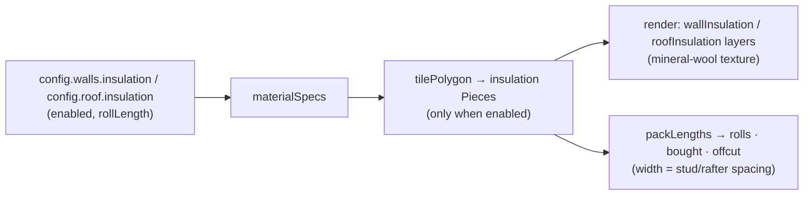

# Design Log #0011 — Insulation

## Background

Walls and roof are currently a framing + OSB + membrane + cladding/roofing buildup with an open
cavity between studs/rafters. Real sheds insulate that cavity with mineral-wool rolls fitted between
the framing members. There is no insulation in the model today.

## Problem

Add insulation as a **roll material** that lives **in the framing cavity**, visualised on its own
toggleable layer with a mineral-wool look, and accounted for in the BOM as rolls.

Constraints from the request:

1. **Rolls**, treated like the other skin materials (tiled, cut at openings, nested for the BOM).
2. **Roll width is derived, not configured** — wall rolls are as wide as the **stud spacing**, roof
   rolls as wide as the **rafter spacing**. → **two roll types** in the BOM.
3. The **only** independently configurable parameter is **roll length**, **separate for walls and
   roof**.
4. **Switchable per surface, independently** — walls and roof each have an enable toggle; "no
   insulation" (today's state) must remain possible. Default: **off** ("like now").
5. **Separate render layer** per surface so it can be hidden.
6. Mineral-wool **texture**.
7. Edges "probably rough, or no? IDK" — open question (Q1).

## Questions and Answers

- **Q1. Rough edges?** **A (decided): Yes — rough edges.** Insulation pieces get a roughened,
  irregular contour (the clean tiled polygon's perimeter is subdivided and jittered perpendicular to
  each edge) so the slabs read as soft/fluffy rather than crisp boards. Only insulation pieces are
  roughened; the usual black edge outline still wraps the jittered contour. Jitter is deterministic
  per piece (seeded from the piece origin) so it's stable across re-renders.
- **Q2. Where does insulation sit / how thick?** **A: In the framing cavity, inboard of the OSB,
  thickness = framing depth.** Walls: spans the stud depth (`stud.width`), centred at
  `offset = −stud.width/2` (cavity between the footprint plane and the stud inner face). Roof:
  spans the rafter depth (`rafter.width`), centred at `offset = rafter.width/2` (between rafters,
  under the OSB). Thickness is **derived** (framing depth), not configurable — matches "only roll
  length is configurable".
- **Q3. Roll orientation / how it tiles?** **A: Vertical strips, one per framing bay.** A roll is as
  wide as the bay (stud/rafter spacing) and unrolls along the surface height/slope, cut into
  `rollLength` segments. In UV terms `pieceW = spacing` (column width), `pieceH = rollLength`
  (segment length), `columnStep = spacing`, `courseStep = rollLength`, no overlap, no stagger.
- **Q4. Cut at openings?** **A: Yes** — walls use the same outline + opening holes as the OSB
  (`lap = 0`, insulation stays within the footprint, no corner lapping). Roof tiles the full roof
  rect like the roof OSB.
- **Q5. BOM unit?** **A: Rolls** (two lines: wall + roof). 1D-nest each strip's run length
  (`pieceBBox.h`) into `rollLength` via `packLengths`; `width = spacing`. `bought = rolls · spacing ·
rollLength`, `used = Σ piece area`, `offcut = bought − used`. Reuses the membrane roll path.
- **Q6. Defaults?** **A:** roll lengths `walls 8000`, `roof 6000`. **Enabled is preset-driven:**
  `light` ⇒ off, `normal`/`heavy` ⇒ on. The default config is `normal`, so insulation is **on by
  default**; switching to the light preset (or unticking) gives the old no-insulation state.
  `applyPreset` writes `walls.insulation.enabled` / `roof.insulation.enabled` from the preset.
- **Q7. What about the roll _width_ changing when stud/rafter spacing changes?** **A:** It just
  follows — the spec reads `config.walls.studSpacing` / `config.roof.rafterSpacing` live, so the BOM
  roll width and the on-screen bay width track the framing automatically.

## Design



**Config (`config/types.ts`):**

```ts
export interface InsulationConfig {
  enabled: boolean
  rollLength: Millimetres // roll width is derived from stud/rafter spacing
}
// WallConfig gains:  insulation: InsulationConfig
// RoofConfig gains:  insulation: InsulationConfig
```

**Material (`model/materials.ts`):** add `'insulation-wall' | 'insulation-roof'` to `MaterialId`.
New helper:

```ts
function insulation(id, label, rollLength, spacing, thickness): MaterialSpec {
  return {
    id,
    label,
    pieceW: spacing,
    pieceH: rollLength,
    courseStep: rollLength,
    columnStep: spacing,
    stagger: false,
    thickness,
    dims: `${spacing}×${rollLength}`,
  }
}
```

`materialSpecs` builds the two specs from `walls.studSpacing` + `stud.width` and
`roof.rafterSpacing` + `rafter.width`. (Needs the stud/rafter profiles — looked up via `findProfile`,
same as walls/roof already do.)

**Walls (`model/walls.ts`):** when `config.walls.insulation.enabled`, emit
`tilePolygon(surface(insulationOffset), outline(0), holesUv, specs['insulation-wall'])` with
`insulationOffset = −stud.width/2`. Inboard of the OSB, cut around openings, no corner lap.

**Roof (`model/roof.ts`):** when `config.roof.insulation.enabled`, emit
`tilePolygon(roofSurface(rafter.width/2), roofRect, [], specs['insulation-roof'])`.

**Render (`viewer/render.ts`):** two new layers `wallInsulation` (group Walls) /`roofInsulation`
(group Roof); `pieceLayer` maps the two material ids to them; a shared `getInsulationTexture()`
material (mm-based repeat like OSB/membrane). Insulation pieces are rendered with a roughened
perimeter (Q1) — `pieceMesh(piece, mat, rough=true)` jitters the polygon before extrusion, and the
black edge outline wraps the jittered contour.

**Texture (`viewer/textures.ts`):** `getInsulationTexture()` — pale mineral-wool yellow
(~`#e8d98a`) base + dense fibrous strokes + soft mottling, cached like the others.

**BOM (`bom/compute.ts`):** extend the membrane roll loop (or a parallel loop) over
`[['insulation-wall', walls.insulation, walls.studSpacing], ['insulation-roof', roof.insulation,
roof.rafterSpacing]]`; skip when no pieces (disabled ⇒ none). Nest `pieceBBox(p).h` into `rollLength`,
`width = spacing`. Category: "Insulation".

**UI (`ui/ConfigPanel.tsx`):** Walls section — `CheckboxRow "Insulation"` (marks the config custom)

- `NumberRow "Insulation roll length"`. Roof section — same. Layers panel picks up the two new
  layers automatically (driven by `LAYERS`); a `hiddenLayers(config)` helper in `App.tsx` hides each
  when its surface's insulation is disabled (alongside the existing `roofBattens` rule).

## Implementation Plan

1. `config/types.ts` (+`InsulationConfig`, add to `WallConfig`/`RoofConfig`), `defaults.ts` (off).
2. `materials.ts` — `MaterialId` + insulation specs.
3. `walls.ts` / `roof.ts` — emit insulation pieces when enabled.
4. `textures.ts` — `getInsulationTexture()`.
5. `render.ts` — layers + `pieceLayer` + material routing.
6. `bom/compute.ts` — two roll lines.
7. `ConfigPanel.tsx` (toggles + roll-length rows) + `App.tsx` (`hidden` for disabled layers).
8. Tests: enabled ⇒ insulation pieces appear, cut at openings, inboard of OSB; disabled ⇒ none;
   BOM roll width = stud/rafter spacing; rolls ≥ area lower bound.

## Trade-offs

- ✅ Reuses the existing tiling + nesting + layer machinery; minimal new concepts.
- ✅ Off by default → no change to current output until enabled.
- ❌ More geometry when enabled (one strip per bay × roll segments).
- Insulation modelled as flat slabs filling the full cavity depth (no compression/friction-fit gap) —
  fine for a quantity/visual tool.

## Verification

- Toggling Walls/Roof insulation on adds pieces on the `wallInsulation`/`roofInsulation` layers,
  sitting in the cavity inboard of the OSB, cut at openings; toggling off removes them and the layer.
- BOM shows two "Insulation" roll lines with `width = studSpacing` / `rafterSpacing`; `offcut ≥ 0`.
- Changing stud/rafter spacing changes the BOM roll width.

## Implementation Results

Implemented as designed. `InsulationConfig { enabled, rollLength }` added to `WallConfig` and
`RoofConfig` (defaults: walls 8000, roof 6000, both enabled since the default preset is `normal`).
`materialSpecs` builds `insulation-wall` / `insulation-roof` specs (`pieceW = spacing`,
`pieceH = rollLength`, `thickness = stud/rafter width`). Walls emit cavity pieces at
`offset = −stud.width/2` (outline lap 0, cut at openings); roof at `offset = rafter.width/2` over the
full roof rect — both only when `enabled`. New `wallInsulation` / `roofInsulation` layers, hidden
via `hiddenLayers(config)` in `App.tsx` when disabled. `getInsulationTexture()` renders pale fibrous
mineral wool; insulation pieces use a roughened, deterministically-jittered perimeter
(`roughenOutline` + `mulberry32` seeded per piece). BOM adds an "Insulation" category with two roll
lines, nesting each strip's run into `rollLength` (width = stud / rafter spacing).

**Deviations from the design:**

- **Default state.** The design's Q6 first proposed off-by-default; per the user's answer it is now
  **preset-driven** — `light` off, `normal`/`heavy` on (via a new `insulation` field on
  `PresetDefinition` written by `applyPreset`). Default config is `normal`, so insulation is on by
  default; the light preset (or unticking) restores the old no-insulation state.
- **Rough edges.** Q1 originally recommended flat pieces; the user chose rough, so insulation is the
  one material rendered with a jittered contour.
- **Roll-length input is not disabled when off** (NumberRow has no disabled state); harmless since it
  has no effect while insulation is off.

**Tests:** 48/48 (added 6: enabled/disabled emission, inboard-of-OSB, framing-depth thickness,
opening cut, two BOM roll types sized to spacing with non-negative offcut, preset enabling). `tsc` +
Prettier + `vite build` clean.

## Refinement — cavity-accurate placement, recess & inward roughening

First cut placed insulation as one full-wall/full-roof tiled sheet "inside the wall", which (a) was
coplanar with the stud/rafter faces (surface tearing) and (b) ignored the framing layout — strips
crossed studs, plates and rafters. Reworked so insulation sits **in the actual cavities**:

- **Recess (Q-tear).** Insulation thickness is now `framingDepth − 2·INSULATION_RECESS` (5 mm/face),
  kept centred in the cavity, so its broad faces tuck just inside the stud/rafter faces — no
  coplanar z-fighting.
- **Per-bay strips.** New `tileBays(surface, bays, outline, holes, spec)` in `model/tiling.ts`: each
  bay is a UV rect already inset off the members (½ member thickness per side), split into
  `rollLength` segments along v, cut around opening holes, and clipped to a convex `outline`.
  - **Walls** (`walls.ts`): bay boundaries = the stud positions plus the wall ends; vertical band is
    between the plates (`bottomPlateTop … topPlatesBottom`), with a second band
    (`rectTopY … maxTop`) on gable walls clipped to the rake via `outline(0)`. So strips never cross
    a stud, plate or the rake.
  - **Roof** (`roof.ts`): bays are between consecutive rafters (inset ½ rafter thickness), spanning
    only the heated footprint `z ∈ [0, base.depth]` (not the overhangs).
- **Inward-only roughening** (`render.ts`): `roughenOutline` now jitters edge midpoints **only toward
  the interior** (the CCW left normal), so the fuzzy contour can never bulge past the piece's
  bounding box — which is itself recessed off the framing. No rough edge protrudes a stud/rafter.

`tilePolygon` is unchanged and still used for OSB/membrane/cladding/roofing; insulation no longer
uses it. **Tests:** 49 total (the framing-depth-thickness test became a "recessed within depth"
check, plus a new "strips stay within a stud bay" invariant). `tsc` + Prettier + `vite build` clean.

## Refinement 2 — cavities from the real framing (above/below openings)

The per-bay version still broke insulation on the **bare global stud grid** (`studUs`) for the full
wall height. Above a header / below a sill, the field studs are _blocked_ (not built) and the real
framing is king/jack/**cripple** studs on the opening's own grid (`uStart + k·spacing`). So the bays
left gaps at grid positions where no stud existed — revealing the membrane behind (visible from
inside).

Fix: derive the wall insulation cavities by **subtracting the actual framing footprints** from the
between-plates band, instead of assuming a grid.

- `buildOpeningFraming` now also returns `solids: UvRect[]` — the (u, world-y) footprints of its
  king/jack/cripple studs, the header, the sill, and the opening void.
- `walls.ts` accumulates `framingSolids` (those plus each built field stud), then the main band is
  `rectMinusRects(band, framingSolids.grown)` → the true cavities (correct around openings, jacks
  and cripples), each grown by a 2 mm clearance and filtered of slivers. The gable triangle keeps the
  simple grid bays (no openings there). `rectMinusRects` is now exported from `model/tiling.ts`.

**Tests:** 50 total (added a regression: above the default window header, insulation must cover the
global-grid `u=1800` — which has no stud — and must _not_ cover `u=2200` where a real cripple sits).
`tsc` + Prettier + `vite build` clean.
