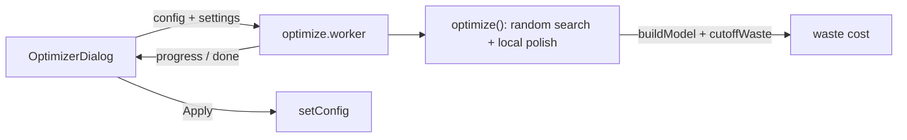

# Design Log #0015 — Timber & OSB Cut-off Optimizer

## Background

The BOM nests timber into stock boards (`packLengths`) and OSB into sheets (`packSheets`), reporting
offcut. Small changes to dimensions/positions can make pieces fit stock much better, cutting waste.

## Problem

A BOM dialog that lets the user nudge a few parameters by a bounded percentage and **searches** for
the variation that minimises timber + OSB **cut-off waste cost**, then previews it before applying.

Tunable parameters: **base dimensions**, **roof overhangs**, **opening horizontal positions** (all
openings), **window sizes** (windows only — never doors).

## Questions and Answers

- **Q1. Objective?** **A: Wasted material cost (₴)** — Σ timber offcut m × `prices[timber:<id>]` +
  Σ OSB offcut m² × `prices[sheet:<id>]`. Unifies the two materials by money.
- **Q2. Variation control?** **A: Per-group %** — independent enable + percent for base / overhangs /
  opening positions / window sizes.
- **Q3. Apply?** **A: Preview, then Apply on confirm** — show before/after waste + the per-parameter
  changes; Apply writes them to the config.
- **Q4. Where does the search run?** **A: A Web Worker** (the model layer is pure, no DOM), so the UI
  stays responsive; progress is posted back. Time-boxed (~2 s budget) with a hard eval cap.
- **Q5. How is % interpreted per parameter?** **A:** ± (pct % × current value) for base dims,
  overhangs and window sizes; ± (pct % × wall length) for opening **positions** (a position is a
  location, not a magnitude). All candidates are clamped to the existing validation ranges and
  cross-field rules (opening within its wall; window ≤ wall).

## Design

- **`optimizer/waste.ts`** — `cutoffWaste(model, config): { cost, timberOffcutM, osbOffcutM2 }`,
  reusing `packLengths`/`packSheets` + `config.prices`.
- **`optimizer/optimize.ts`** (pure, testable) — `optimize(config, settings, onProgress?)`:
  - Builds a list of numeric **knobs** from the enabled groups, each with `[lo, hi]` bounds (Q5) and
    an `assign(config, v)`.
  - `candidate(values)` = clone → assign knobs → **sanitize** (clamp openings to walls, windows to
    valid sizes, round to mm) → mark preset `custom`.
  - Objective = `cutoffWaste(buildModel(candidate), candidate).cost`. Baseline = current config.
  - **Random search** within bounds for a time budget, keeping the best (baseline seeded), then a
    bounded **coordinate-descent polish** around the best. Returns `{ config, baseline, optimized,
changes:[{label,from,to}], evals }`.
- **`optimizer/optimize.worker.ts`** — wraps `optimize`, posts `{progress}` / `{done,result}`.
- **`ui/OptimizerDialog.tsx`** — per-group rows (checkbox + % ), Optimize button → worker + progress
  bar → results (baseline vs optimized ₴, savings, change table) → Apply (`setConfig`) / Close.
- **`ui/BomTable.tsx`** — an "Optimize cut-off…" button next to "Edit costs…".

## Implementation Plan

1. `optimizer/waste.ts` (+ test).
2. `optimizer/optimize.ts` types + search (+ test: optimized ≤ baseline, candidates valid & in bounds).
3. `optimizer/optimize.worker.ts`.
4. `ui/OptimizerDialog.tsx` + `BomTable` button + `index.css`.

## Trade-offs

- ✅ Pure core → unit-testable; worker keeps UI smooth; reuses the real nesting so the objective
  matches the BOM exactly.
- ❌ Random/local search isn't globally optimal (the objective is discontinuous as pieces snap to
  stock); good-enough within a tight band. Time-boxed, so results vary slightly run to run.
- Materials priced at 0 don't influence the search (only timber + OSB matter here anyway).

## Verification

- Optimized waste cost ≤ baseline; every evaluated candidate is valid (openings inside walls, windows
  sized sanely) and within the ± bands; doors never resized; Apply reproduces the previewed config.

## Implementation Results

Implemented as designed. `optimizer/waste.ts` `cutoffWaste` mirrors the BOM nesting (`packLengths`/
`packSheets`) and values timber + OSB offcut with `config.prices`. `optimizer/optimize.ts` builds
per-group **knobs** (base w/d, the three overhangs, every opening's position, window w/h — never door
sizes), `candidate()` clones → assigns → `sanitize()` (rounds to mm, clamps openings into their wall,
windows to valid sizes, doors keep size), then random search (time-boxed, default 2.5 s, 6 k-eval cap)

- a coordinate-descent polish; returns `{config, baseline, optimized, changes, evals}`.
  `optimize.worker.ts` runs it off-thread, posting progress. `OptimizerDialog.tsx` has the per-group
  checkbox+% rows, a progress bar, a baseline→optimized waste summary with savings, a from→to change
  table, and Apply (writes `config`). `BomTable` gained an "Optimize cut-off…" button (now takes
  `config`).

**Notes / deviations:** opening **positions** vary by ±(pct × wall length); everything else by
±(pct × value). The worker bundles as its own Vite chunk (`optimize.worker-*.js`). Results vary
slightly run-to-run (random + time-boxed), and `optimized ≤ baseline` always holds (baseline is the
seed).

**Tests:** 71 total (added 7: waste is non-negative with positive cost; optimized ≤ baseline;
candidate is buildable; openings stay inside walls; doors never resized; base stays within the band;
all-disabled ⇒ no changes). `tsc` + Prettier + `vite build` clean (worker chunk emitted).

### Follow-up — fix shrink bias (objective = waste fraction) + speed slider

The first objective (absolute waste **cost**) had the shrink bias predicted in the trade-offs: less
material always means less absolute offcut, so the search drove base dimensions to the lower bound
and never increased them. Changed the objective to the **cost-weighted waste fraction**
`offcutCost / boughtCost` (scale-invariant), so it rewards _fitting the stock_ rather than shrinking
— dimensions can now move up or down. `cutoffWaste` returns `{ offcutCost, boughtCost, fraction, … }`;
`OptimizeResult` carries `baselineWaste`/`optimizedWaste` (fraction) plus `baselineCost`/
`optimizedCost` (₴) for display. The dialog shows **Waste % → %** (the minimised metric, with the
points saved) and the **cut-off cost ₴ → ₴**.

Also added a **Search time** slider (0.5–10 s, default 2.5 s) feeding `settings.budgetMs`, so the user
trades speed for thoroughness. Tests updated to the new fields (still 71). `tsc` + Prettier +
`vite build` clean.

**Follow-up fix:** the slider appeared to do nothing above ~2.5 s because the `MAX_EVALS` backstop
(20 k) was hit first (measured: a 6 s budget finished in 2.8 s). Raised it to 500 k — purely a
runaway guard now — so the time budget is the real limit. Verified elapsed scales linearly across
0.5–10 s (500 ms→0.52 s … 10 s→10.0 s, ~94 k evals).

### Option — downsize base only

Added `OptimizeSettings.downsizeBase` (UI checkbox "Only downsize base dimensions", under the base
group). When set, the base width/depth knobs cap their **upper** bound at the current value, so the
optimizer may shrink the footprint but never grow it. **Tests:** 73 (added: with `downsizeBase`,
base dims never exceed the originals).

### Fix — reject overlapping openings

`sanitize` clamps each opening to its wall independently, so the optimizer found configs where a door
and window overlapped on the same wall. Added `openingsValid()` — openings on a wall must be disjoint
with a `2 × stud.thickness` clearance for their king studs — and `evalAt` returns `Infinity` for any
candidate that fails it, so collisions are never selected or applied. **Tests:** 72 (added: result
never overlaps openings on a wall).
